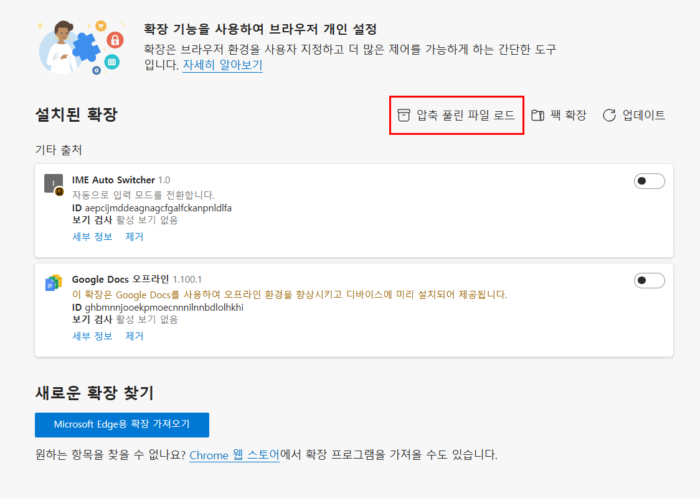
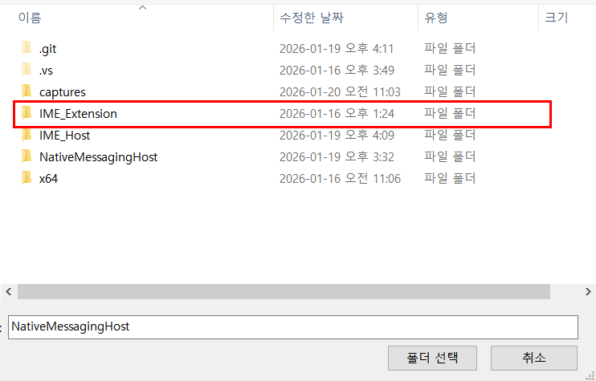

# Chromium IME Helper (한영 전환)

## 1. 개요 (Overview)

### 1.1. 배경

과거 Internet Explorer(IE)에서는 CSS 속성인 `ime-mode: active`를 통해 입력 필드 진입 시 자동으로 한글 모드로 전환하는 기능을 지원했습니다. 하지만 Edge, Chrome 등 Chromium 기반의 최신 브라우저에서는 해당 속성을 더 이상 지원하지 않습니다.

이로 인해 사용자가 검색창이나 입력 폼에 진입할 때마다 수동으로 한/영 키를 눌러야 하는 불편함(UX 저하)이 발생했습니다. 본 프로젝트는 **Native Messaging Host** 기술과 **Custom URI Scheme**을 활용하여, 웹페이지에서 브라우저 외부의 C++ 애플리케이션을 호출함으로써 **OS 레벨에서 강제로 한글 입력 모드로 전환**시키는 솔루션입니다.

### 1.2. 동작 방식 비교

본 솔루션은 하나의 실행 파일(`IME_Helper.exe`)로 두 가지 호출 방식을 모두 지원합니다. 각 방식의 장단점은 아래와 같습니다.

| 구분 | (1) Custom Scheme 방식 | (2) Edge Extension Middleware 방식 |
| --- | --- | --- |
| **호출 방법** | `einzime://` 프로토콜 호출 (iframe 등) | `window.postMessage` → Extension → Native App |
| **장점** | • 구조가 단순하고 직관적임<br>별도의 확장 프로그램 설치 불필요 | • **양방향 통신 가능** (성공/실패 여부 회신)<br>• 사용자 제스처(클릭) 없이 백그라운드 실행 용이 |
| **단점** | • **단방향 호출** (결과값 수신 불가)<br> • 최초 실행 시 실행허가 팝업 노출됨<br> • AutoLaunchProtocolsFromOrigins 레지스트리 등록하지 않을 경우 액션으로만 실행될 수 있음 | • 브라우저 확장 프로그램(Extension) 배포 및 설치 필요<br>• 구조가 상대적으로 복잡함 |
| **공통 사항** | **[필수]** Windows 레지스트리 등록 필요 (AutoLaunchProtocolsFromOrigins) | **[필수]** Windows 레지스트리 등록 필요(NativeMessagingHosts) |

---

## 2. 사용 방법 (Usage)

### 2.1. 사전 준비 (설치)

1. `IME_Host` 폴더를 복사하여 `C:/IME_Host` 경로에 붙여넣습니다. (보안 이슈 우회용)
2. 제공된 레지스트리 등록 파일(`.reg`)을 실행하여 Custom Scheme(`einzime://`)과 Native Messaging Host를 시스템에 등록합니다.
   1. register_nmh.reg 파일은 NativeMessagingHosts을 레지스트리에 등록합니다.
   2. register_custom_scheme.reg 파일은 Custom Scheme을 레지스트리에 등록합니다.
   3. register_all.reg 파일은 한꺼번에 모두 등록합니다.
3. Edge 브라우저의 주소창에 edge://extensions을 입력하여 Extension 창으로 들어갑니다.
   1. "압축 풀린 파일 로드" 버튼을 선택합니다.
      1. 
   2. "IME_Extension" 폴더를 선택합니다.
      1. 
   3. 설정된 Extension의 ID 값을 "einz_imehelper.json" 파일의 "allowed_origins" 속성 내 <익스텐션 ID 값>에 복사 붙여넣기 해줍니다.
      1. 
---

### 2.2. 테스트 시나리오 (Naver 검색창 기준)

웹페이지(예: 네이버)에서 검색 입력창에 포커스를 둔 상태로 한글 전환이 되는지 테스트하는 방법입니다.

#### (1) Custom Scheme 방식 사용법 (`einzime://`)

이 방식은 결과값을 받을 수 없습니다.

1. 네이버 메인 화면에 접속합니다.
2. 검색창에 영어로 `ddd` 등을 입력해 둡니다. (현재 영문 상태 확인)
3. **F12**를 눌러 개발자 도구(Console)를 엽니다.
4. 아래 코드를 입력하고 엔터(Enter)를 칩니다.
```javascript
// iframe을 생성하여 프로토콜을 호출하는 함수
function requestImeChangeByScheme() {
    let iframe = document.createElement("iframe");
    iframe.style.display = "none";
    iframe.src = "einzime://change";
    document.body.appendChild(iframe);
    setTimeout(() => {
        document.body.removeChild(iframe);
    }, 1000);
}
requestImeChangeByScheme();

```
5. 엔터를 친 직후, 검색창에 포커스를 둡니다.
6. 잠시 후 작업 표시줄의 입력기가 '가'로 바뀌는지 확인합니다.
---

#### (2) Edge Extension Middleware 방식 사용법 (`postMessage`)

이 방식은 확장 프로그램(Extension)이 설치되어 있어야 하며, 비동기적으로 결과를 회신받을 수 있습니다.

1. 네이버 메인 화면에 접속합니다.
2. 검색창에 영어로 `ddd` 등을 입력해 둡니다.
3. **F12**를 눌러 개발자 도구(Console)를 엽니다.
4. 아래 코드를 입력하고 엔터(Enter)를 칩니다.
```javascript
// 1. 응답을 받을 리스너 등록 (성공 여부 확인용)
window.addEventListener("message", (event) => {
    if (event.data.type === "RES_IME_KOREAN") {
        console.log("✅ 결과 수신:", event.data.payload); // {status: 'ok'}
    }
});

// 2. 3초 뒤에 한글 전환 요청 발송
setTimeout(() => {
    console.log("한글 전환 요청 발송 (Extension)");
    // Extension의 Content Script로 메시지 전달
    window.postMessage({ type: "REQ_IME_KOREAN" }, "*");
}, 3000);

```

5. 엔터를 친 직후, **즉시 마우스로 검색창을 클릭**하여 입력 대기 상태를 만듭니다. (App이 활성화된 창을 감지하기 위함)
6. 3초 후 콘솔에 `✅ 결과 수신: {status: 'ok'}`가 찍히고, 입력기가 '가'로 바뀌는지 확인합니다.